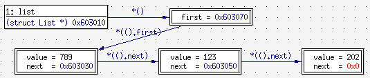
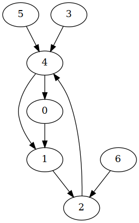
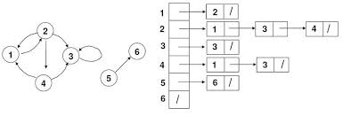

# C Practicum - Grafen

Het doel van dit practicum is om wat dieper in te gaan op een aantal belangrijke
concepten uit de C programmeertaal die ook tijdens de oefenzittingen aan bod
zullen komen.  Een goede manier om hiermee
wat beter vertrouwd te worden is om een API te implementeren voor een gegevensstructuur. In dit
practicum zullen jullie daarom een aantal operaties op
[grafen](https://nl.wikipedia.org/wiki/Grafentheorie) moeten implementeren
waarbij jullie gebruik moeten maken van een *gelinkte lijst*.

## Inhoudstafel

- [1. Afspraken](#1-afspraken)
    + [Gedragscode](#gedragscode)
    + [Vragen](#vragen)
- [2. Achtergrond](#2-achtergrond)
  * [2.1 Dynamisch geheugenbeheer](#21-dynamisch-geheugenbeheer)
  * [2.2 Gelinkte lijsten](#22-gelinkte-lijsten)
  * [2.3 Grafen](#23-grafen)
- [3. Opgave](#3-opgave)
    + [Opgave downloaden](#opgave-downloaden)
  * [3.1 Structuur](#31-structuur)
  * [3.2 Compileren en uitvoeren](#32-compileren-en-uitvoeren)
  * [3.3 Voorstelling van een graaf in een computerprogramma](#33-voorstelling-van-een-graaf-in-een-computerprogramma)
  * [3.4 De te implementeren API](#34-de-te-implementeren-api)
    + [Te implementeren](#te-implementeren)
    + [Reeds geïmplementeerd](#reeds-ge-mplementeerd)
- [4. Evaluatiecriteria](#4-evaluatiecriteria)
  * [4.1. Correcte inzending](#41-correcte-inzending)
  * [4.2. Functionaliteit](#42-functionaliteit)
  * [4.3. Leesbaarheid code](#43-leesbaarheid-code)
  * [4.4. Gebruik van informaticawerktuigen](#44-gebruik-van-informaticawerktuigen)
    + [Versiebeheer](#versiebeheer)
    + [Debugger](#debugger)
    + [Testen](#testen)
    + [Precondities en invarianten](#invarianten--precondities-en-postcondities)
- [5. Indienen](#5-indienen)
- [6. Verdediging](#6-verdediging)

## 1. Afspraken

Overloop eerst de afspraken vooraleer je begint aan de opgave.
Dit practicum heeft AC-code [NES-NGW-TP-TS-NPP-NVP](https://wms.cs.kuleuven.be/cs/english/study/assignment-commons/explain?ac_code=NES-NGW-TP-TS-NPP-NVP)

> **Belangrijk**:
> In tegenstelling tot het JavaScript-project is het niet de bedoeling dat je code kopieert van online bronnen (ook niet met bronvermelding).

### Gedragscode

De practica worden gequoteerd, en het examenreglement is dan ook van
toepassing. Soms is er echter wat onduidelijkheid over wat toegestaan is en
niet inzake samenwerking bij opdrachten zoals deze.
De programmacode die ingediend wordt, moet volledig het
resultaat zijn van werk dat je zelf gepresteerd hebt. Je mag je werk uiteraard
bespreken met andere studenten, in de zin dat je praat over algemene
oplossingsmethoden of algoritmen, maar de bespreking mag niet gaan over
specifieke code die je aan het schrijven bent.
Als je het met anderen over
je practicum hebt, mag dit er dus *nooit* toe leiden, dat je op om het even
welk moment in het bezit bent van een geheel of gedeeltelijke kopie van het
opgeloste practicum van anderen, onafhankelijk van of die code
op papier staat of in elektronische vorm beschikbaar is, en
onafhankelijk van wie de code geschreven heeft (medestudenten,
eventueel uit andere studiejaren, volledige buitenstaanders,
internetbronnen, e.d.). Dit houdt tevens ook in dat er geen enkele geldige
reden is om je code door te geven aan medestudenten, noch om deze
beschikbaar te stellen via publiek bereikbare directories of websites.
Elke student is verantwoordelijk voor de code en het werk dat hij of zij
indient. Als er tijdens de beoordeling van het practicum twijfels zijn over
het feit of het practicum zelf gemaakt is (bv. gelijkaardige code met andere
ingediende code), zal de student gevraagd worden hiervoor een
verklaring te geven. Indien dit de twijfels niet wegneemt, zal er worden
overgegaan tot het melden van een onregelmatigheid, zoals voorzien in het
[onderwijs- en examenreglement](https://www.kuleuven.be/onderwijs/oer/) van de
KU Leuven.
Alle inzendingen worden automatisch met elkaar vergeleken met behulp van
plagiaatsoftware. Deze software bepaalt de mate waarin
projecten op elkaar gelijken. Bij een sterke gelijkenis zullen de desbetreffende
projecten handmatig nagekeken worden.

### Vragen

Alle vragen buiten de oefenzittingen, *inclusief vragen aan medestudenten*, moeten
gesteld worden via het C discussieforum op Toledo. Alle antwoorden 
van assistenten op het discussieforum worden beschouwd als **deel van de opgave** 
en kunnen bijgevolg aanvullingen of correcties bevatten. Zorg ervoor dat je 
deze posts leest!

> :bulb: Wie graag meldingen ontvangt van nieuwe berichten op discussiefora, kan dit instellen via de algemene [Toledo Ultra meldingsinstellingen](https://ultra.edu.kuleuven.cloud/ultra/stream/notification/settings).

Gebruik de oefenzittingen zeker ook om vragen te stellen over het practicum. De
laatste oefenzitting kunnen jullie zelfs helemaal gebruiken om aan het practicum te werken.

## 2. Achtergrond

In dit hoofdstuk zullen we kort een aantal concepten beschrijven die 
van belang zijn voor dit practicum.

### 2.1 Dynamisch geheugenbeheer

Het dynamisch (tijdens de uitvoering van een programma) toekennen van geheugen
komt van pas wanneer het moeilijk te voorspellen valt hoeveel geheugen een
programma nodig zal
hebben. Dankzij dynamische geheugentoekenning kan een programma vermijden
onnodig veel geheugen te reserveren door op een beter geïnformeerde manier te
bepalen hoeveel geheugen er werkelijk nodig is. Dynamische geheugentoekenning
impliceert ook dat het dynamisch toegekende geheugen terug zal moeten worden
vrijgegeven wanneer het niet meer wordt gebruikt. Het vrijgeven van ongebruikt
geheugen is noodzakelijk om te vermijden dat het
geheugen van een computersysteem
"[lekt](https://nl.wikipedia.org/wiki/Geheugenlek)"
of zelfs volledig uitgeput
geraakt. Het dynamisch toekennen en vrijgeven van geheugen wordt *dynamisch
geheugenbeheer* genoemd.
Dynamisch geheugenbeheer is één van de moeilijkere aspecten van programmeren
in C, en het is de oorzaak van veel problemen en bugs. In tegenstelling 
tot andere talen zoals Python of Java, die deze taak volledig uit handen van
de programmeur nemen, laat C de verantwoordelijkheid aan de ontwikkelaar om
zelf het dynamisch geheugen te beheren. Determinisme en performantie zijn de
belangrijkste redenen om deze taak niet te automatiseren.

De C header `stdlib.h`, een onderdeel van de standaard C bibliotheek, bevat de
functie `void *malloc(size_t size)`
([man malloc](https://linux.die.net/man/3/malloc))
die
gebruikt wordt om een deel van het
beschikbare dynamische geheugen toe te kennen. Deze functie zal trachten de
gevraagde hoeveelheid geheugen toe te kennen en zal bij een succesvolle
toekenning een *pointer* naar dat toegekende geheugen teruggeven. Wanneer het
toekennen faalt, is het resultaat van de functie de `NULL` pointer. Het is
belangrijk om te verifïeren dat het toekennen van het geheugen succesvol is
vooraleer de pointer te gebruiken om het geheugen te benaderen.
Om eerder toegekend geheugen terug vrij te geven, voorziet C de functie `void
free(void *ptr)`
([man free](https://linux.die.net/man/3/free))
die een pointer naar met `malloc` toegekend geheugen verwacht
en het geheugen terug ter beschikking stelt voor andere doeleinden.
Zoals reeds eerder aangehaald, is het belangrijk om ongebruikt maar toegekend
geheugen terug vrij te geven om te vermijden dat kostbaar geheugen onbeschikbaar
wordt ([geheugenlek](https://nl.wikipedia.org/wiki/Geheugenlek)).

Dynamisch geheugenbeheer zal tijdens de
[tweede oefenzitting](https://gitlab.kuleuven.be/distrinet/education/informaticawerktuigen/oefenzittingen/c/tree/main/les5-scopes-and-lifetimes) behandeld worden. Wie dat wenst, kan de desbetreffende [video](https://www.youtube.com/watch?v=ti8-oMvOlO4) al eens bekijken.

### 2.2 Gelinkte lijsten

Een *gelinkte lijst* is een gegevensstructuur die vaak gebruikt wordt om
lijsten voor te stellen. Een gelinkte lijst is zeer flexibel omdat die het
mogelijk maakt om op een efficiënte manier elementen toe te voegen en te
verwijderen op eender welke positie in de lijst. Een ander voordeel is dat de
grootte van een gelinkte lijst dynamisch (terwijl het programma wordt
uitgevoerd) kan veranderen: er staat met andere woorden geen limiet op het
aantal elementen dat je aan de lijst kan toevoegen.
Dit staat in schril contrast met een *array*. Een array (of rij) is namelijk
een ander soort gegevensstructuur die, net zoals een lijst, gebruikt kan
worden om meerdere elementen van iets bij te houden maar die wel gekenmerkt
wordt door een vaste grootte. Twee belangrijke nadelen van het werken met
arrays is dat de programmeur op voorhand (terwijl het programma geschreven
wordt) het maximaal aantal elementen moet kennen dat een array kan bevatten en
dat het helemaal niet zo efficiënt is om elementen toe te voegen of te
verwijderen op willekeurige posities in de rij.

Een manier om in C een gelinkte lijst voor te stellen is door gebruik te maken
van twee *structs*, namelijk`struct list` en`struct element`. De eerste
*struct* wordt dan gebruikt als het type dat de volledige lijst voorstelt
terwijl de tweede *struct* gebruikt wordt als het type van een element in de
lijst. Elk element bevat een "payload" (in het voorbeeld hieronder het geheel
getal `value`) en een *pointer* naar het volgende element in de lijst.

```c
struct list
{
    struct list_element *first;
};

struct list_element
{
    int value;
    struct list_element *next;
};
```

Het einde van een lijst wordt voorgesteld door een `NULL` pointer. Deze waarde
wordt gedefinieerd door de standaard C header *stdlib.h*.

Onderstaande afbeelding is een weergave van een enkelvoudig gelinkte lijst met
behulp van het programma *DDD*, een grafische front end voor de
[GDB](https://www.gnu.org/software/gdb/) debugger.  Op het moment van de
weergave bevatte de lijst in kwestie 3 elementen: 789, 123 en 202.



[Pointers](https://gitlab.kuleuven.be/distrinet/education/informaticawerktuigen/oefenzittingen/c/tree/main/les4-afgeleide-datatypes) ([video](https://www.youtube.com/watch?v=XxlZ4nYIqng)) en [gelinkte lijsten](https://gitlab.kuleuven.be/distrinet/education/informaticawerktuigen/oefenzittingen/c/tree/main/les6-dynamische-structuren) ([video](https://www.youtube.com/watch?v=NBNHEppt7d8)) zullen eveneens tijdens de  tweede oefenzitting
behandeld worden.

### 2.3 Grafen
  
Een graaf (Engels: graph) is een wiskundig object dat is samengesteld uit knopen
(Engels: vertex) waarvan sommige paarsgewijs met elkaar verbonden zijn door
bogen (Engels: edge). Een gerichte graaf is een graaf waarbij de bogen een
richting hebben. De node waarin de boog vertrekt noemen we dan de staart
(Engels: tail) van de boog en de node waarin de boog toekomt het hoofd
(Engels: head). Een gewogen graaf is een graaf waarbij aan de bogen gewichten
worden toegekend in de vorm van getallen.  Wanneer we een graaf grafisch
voorstellen, dan wordt voor een knoop typisch een punt, een cirkel of een
veelhoek gebruikt, voor een boog een lijn en voor een gerichte boog een pijl.
Zo is onderstaande afbeelding bijvoorbeeld een weergave van een gerichte graaf
met zeven knopen.



Grafen zijn zeer belangrijk binnen de informatica. Problemen uit de
informatica, zoals bijvoorbeeld het zoeken van het kortste pad tussen
twee steden, worden vaak gemodelleerd en opgelost met behulp van grafentheorie.
Om het kortste pad probleem op te lossen, is het namelijk handig om het netwerk
van wegen en steden voor te stellen als een niet-gerichte gewogen graaf waarbij
steden worden voorgesteld als knopen, wegen als bogen en afstanden tussen
verbonden steden als gewichten. Maar evengoed een sociaal netwerk, de manier
waarop functies elkaar oproepen in een computerprogramma of het plannen van
taken waarbij sommige taken pas gestart kunnen worden nadat andere taken
reeds voltooid zijn, zijn allemaal voorbeelden van toepassingen binnen de
informatica waarbij dankbaar gebruik gemaakt wordt van grafentheorie.

## 3. Opgave

Tijdens dit practicum zullen jullie een API (Application Programmable Interface) 
voor gerichte gewogen grafen moeten implementeren. Hierbij komen de volgende 
zaken aan bod:

- de voorstelling van een graaf in een programma
- begrijpen hoe een functie werkt aan de hand van zijn
  [man page](https://en.wikipedia.org/wiki/Man_page)
- werken met pointers
- werken met arrays
- werken met gelinkte lijsten
- dynamisch geheugenbeheer
- het dynamisch toekennen van geheugen voor een array van structs

Om dit tot een goed einde te brengen, zullen jullie gebruik moeten maken
van een gegevensstructuur die gebaseerd is op een enkelvoudig gelinkte lijst,
waarvoor jullie dus een aantal operaties zullen moeten implementeren.

#### Opgave downloaden

Via GitLab hebben hebben jullie toegang tot een eigen private Git
repository die de nodige bestanden bevat om aan je practicum te beginnen. De
meegeleverde bestanden mogen niet verwijderd worden, en sommige bestanden mogen 
ook niet gewijzigd worden (dit staat hieronder per bestand aangeduid). Het is 
uiteraard wel toegestaan om eigen bestanden toe te voegen.

De repository kan je klonen met het commando:

```bash
git clone git@gitlab.kuleuven.be:distrinet/education/informaticawerktuigen/2023-2024/c-project/graphs-<r-nummer>.git
```

waarin jullie ```<r-nummer>``` moeten vervangen door jullie eigen r-nummer.

### 3.1 Structuur

Nu zullen we wat dieper ingaan op de structuur van de opgave. Elk meegeleverd
bronbestand speelt zijn eigen rol in het implementeren en testen van dit project.
Hieronder overlopen we die bestand per bestand:

- [graph.h](graph.h)
Het headerbestand met de declaraties van de functies die jullie van een
implementatie moeten voorzien. Hierin vinden jullie ook de definities van een
aantal gegevensstructuren die jullie moeten gebruiken bij deze implementatie.
**Aan dit bestand mag niets veranderd worden.**

- [test.h](test.h)
Het headerbestand met de publieke declaraties van de testfuncties.
**Aan dit bestand mag niets veranderd worden.**

- [main.c](main.c)
Bevat de *main* functie die de functie oproept die jullie implementatie
uitvoerig zal testen. Hierin vinden jullie ook voorbeeldcode om te illustreren
hoe de API te gebruiken die door het bestand [graph.h](graph.h)
gedefinieerd wordt. **Aan dit bestand mag eveneens niet veranderd worden.**

- [graph.c](graph.c)
Bevat (lege) definities van de functies die in [graph.h](graph.h) gedeclareerd
worden en die jullie van een implementatie moeten voorzien. Elk van de te implementeren
functies heeft een **TODO** gekregen die dit aangeeft. De implementatie
van een aantal (hulp)functies die jullie van ons krijgen is hier eveneens terug te
vinden. Boven de declaratie van elke functie in [graph.h](graph.h) staat in
commentaar heel precies
uitgelegd wat er van de functies verwacht wordt. Baseer je op deze commentaar
bij het implementeren van de functies. Je mag hier eventueel hulpfuncties aan
toevoegen, maar het functieprototype van bestaande functies mag niet veranderd
worden. De functienaam, het return type en de argumenten van deze functies
mogen dus niet aangepast worden.

- [ta_test.c](ta_test.c)
Bevat de functie *ta_test* die een aantal eenvoudige testen uitvoert. Merk
op dat deze testen zeer beperkt zijn. Zelfs als al deze testen slagen voor
jullie implementatie is dit geen garantie dat er geen fouten meer in jullie
code zitten. Voor de verdediging van jullie project zullen we een uitgebreidere
test suite gebruiken.

- [student_test.c](student_test.c)
We verwachten dat jullie ook zelf testen schrijven. Deze testen moeten jullie
toevoegen aan [student_test.c](student_test.c). Jullie moeten de testen op
dezelfde manier schrijven als de meegeleverde testen in [ta_test.c](ta_test.c).
Bijvoorbeeld de code `TEST(list_contains(l, 1, 0))` verifieert of de functie `list_contains` correct detecteert dat de lijst `l` een gerichte boog bevat van knoop 1 naar knoop 0.
Verder raden we jullie sterk aan om deze testen toe te voegen **terwijl** jullie
aan de implementatie van een functie werken en hier dus niet mee te wachten tot
alle functies geïmplementeerd zijn. Deze aanpak zal jullie helpen om sneller
fouten te vinden. Jullie worden ook beoordeeld op de kwaliteit van jullie
test suite en tijdens de verdediging kunnen we hier vragen over stellen.

### 3.2 Compileren en uitvoeren

Je kan deze bestanden compileren aan de hand van het volgende commando:

```bash
$ gcc -g -std=gnu99 -Wall -Wno-unused-function -Werror main.c student_test.c ta_test.c graph.c -o test
```

De code die jullie schrijven moet compatibel zijn met de ISO/IEC 9899:1999 C
standaard, ook wel C99 genoemd. De *GCC* compiler optie `std=gnu99`zal dit
afdwingen. Met C99 hebben jullie toegang tot het headerbestand *stdbool.h* dat 
het booleaanse type `bool` definieert en de bijhorende booleaanse waarden
`false` en `true`. Voor meer informatie over de rest van de argumenten die aan
*GCC* worden meegegeven, verwijzen we jullie naar de Linux man page van GCC
(`man gcc`).

Wanneer het programma met succes gecompileerd is, kan je het uitvoeren door de
volgende regel in te voeren:

```bash
$ ./test
```

Om te vermijden dat je de bovenstaande commando' s elke keer weer opnieuw moet
intypen, hebben we een [Makefile](Makefile) bestand toegevoegd. Concreet
betekent dit
dat je in plaats van bovenstaande *gcc* commandoregel in te voeren en
vervolgens het
programma handmatig
moet oproepen, eenvoudigweg `make run` kan typen. Het programma *make*
zal er dan voor zorgen dat

- alleen de gewijzigde bestanden opnieuw gecompileerd worden,
- alles correct samengevoegd ("gelinkt") wordt in een uitvoerbaar programma
- het programma wordt uitgevoerd.

### 3.3 Voorstelling van een graaf in een computerprogramma

Er bestaan twee gangbare manieren om een graaf voor te stellen in een
computerprogramma, de buurmatrixrepresentatie (Engels: adjacency matrix) en
de buurlijstrepresentatie (Engels: adjacency list). Omdat de knopen bij deze
twee voorstellingswijzen in een array geplaatst worden, ligt het maximum aantal
knopen op voorhand (bij het aanmaken van een graaf) vast terwijl het aantal
bogen voortdurend kan wijzigen. Wij zullen in dit practicum een graaf
voorstellen door gebruik te maken van de buurlijstrepresentatie.

Bij de buurlijstrepresentatie houden we voor iedere knoop **v** een lijst **l**
van knopen bij zodat voor elke knoop **w** in **l**, **v** en **w** verbonden
zijn door een boog. Bij een niet gerichte graaf wordt deze informatie in de
buurlijsten van beide verbonden knopen bijgehouden, bij een gerichte graaf
alleen maar in de buurlijst van de staart. Onderstaande afbeelding is een
illustratie van deze voorstelling voor een gerichte graaf.



De C gegevensstructuren die jullie hiervoor moeten gebruiken, zijn reeds
reeds gedefinieerd in het C headerbestand [graph.h](graph.h) en jullie 
mogen geen wijzigingen aanbrengen aan deze definities. De knopen in onze
voorstelling van een graaf krijgen een uniek nummer van nul tot het maximum
aantal knopen in de graaf dat, zoals eerder vermeld, bij het aanmaken van de
graaf wordt vastgelegd. Namen voor knopen zijn niet relevant voor onze
representatie en we zullen dus verwijzen naar knopen aan de hand van hun
uniek nummer. De gegevensstructuur die we voor een graaf gebruiken,
`struct graph_s`, bevat een array van buurlijsten (van het type
`struct adjacency_list_s`) die geïndexeerd wordt aan de hand van het
knoopnummer. Een buurlijst dient geïmplementeerd te worden als een enkelvoudig
gelinkte lijst. Een buurlijst tenslotte bestaat uit bogen die worden
voorgesteld door het type `struct edge_s`.

Volgende **invarianten** zijn van toepassing op deze representatie:

- De variabele vertex_count heeft als waarde het aantal knopen dat in de
  graaf aanwezig is. Deze waarde wordt op voorhand vastgelegd bij de
  initialisatie van een graaf.

> Het is **heel belangrijk** dat jullie deze voorstellingswijze van
> grafen goed begrijpen vooraleer aan de slag te gaan.  We verwijzen naar
> [graph.h](graph.h) voor meer details. Ook de functies en de testen die we
> reeds voor jullie geïmplementeerd hebben in respectievelijk
> [graph.c](graph.c) en [ta_test.c](ta_test.c) zijn zeker nuttig
> om de voorstellingswijze beter te begrijpen.
> Stel zeker vragen tijdens de oefenzitingen als deze voorstellingswijze niet
> helemaal duidelijk is.

### 3.4 De te implementeren API

Hier geven we een beknopt overzicht van de operaties die jullie
zullen implementeren. Het bestand [graph.h](graph.h) bevat naast de declaraties
van de functies ook een gedetailleerde beschrijving van elke functie. Een
aantal functies hebben
we al voor jullie geïmplementeerd. **Lees de code van deze functies aandachtig
aangezien ze een bron van inspiratie kunnen
zijn voor jullie eigen code, ze van pas kunnen komen bij het debuggen, en ze
jullie kunnen helpen om onze voorstelling van een graaf beter te begrijpen.**
Verder raden we jullie ook aan om de volgorde van de te implementeren functies
in [graph.c](graph.c) te volgen bij het maken
van het practicum. Een aantal van de functies die eerst komen, zouden later
namelijk wel eens van pas zouden kunnen komen.

#### Te implementeren

```c
edge_t * edge_clone(const edge_t *edge);

bool list_contains(adjacency_list_t list, unsigned head, unsigned tail);

adjacency_list_t list_concat(adjacency_list_t l1, adjacency_list_t l2);

graph_t graph_create(unsigned vertex_count);

unsigned graph_edge_count(graph_t graph);

bool graph_are_connected(graph_t graph, unsigned v1, unsigned v2);

unsigned graph_average_degree(graph_t graph);

unsigned graph_neighbour_count(graph_t graph, unsigned id);

graph_t * graph_reverse(const graph_t * graph);

vertices_t graph_immediate_predecessors(const graph_t * graph, unsigned id);
```

#### Reeds geïmplementeerd

```c
edge_t * list_last(adjacency_list_t list);

unsigned list_size(adjacency_list_t list);

void list_append(adjacency_list_t *list, edge_t *edge);

unsigned graph_degree(const graph_t *graph, unsigned id);

bool graph_connect(graph_t graph, unsigned tail, unsigned head, unsigned weight);

void graph_release(graph_t graph);

void graph_print(const graph_t *graph);
```

## 4. Evaluatiecriteria

In deze sectie beschrijven we kort enkele criteria die we zullen gebruiken om
een score toe te kennen aan het practicum.

### 4.1. Correcte inzending

Zorg ervoor dat je code correct en tijdig is ingediend via GitLab. De code
moet met succes compileren en uitvoeren op een computer van het Departement
Computerwetenschappen door `make run` te typen in de folder waar jullie
repository gekloond werd.

> **Belangrijk**:
> Je kan alleen verdedigen wanneer de laatste versie van je project succesvol compileert.
> Is dit niet het geval, dan zal je niet kunnen verdedigen.
> De eerste badge die je terugvindt op je GitLab projectpagina geeft aan of je programma compileert of niet, maak hier zeker gebruik van.
> Als je vermoedt dat één of meer badges een foutief resultaat aangeven, kan je dit best zo snel mogelijk melden.

### 4.2. Functionaliteit

In de eerste plaats wordt er gekeken naar een correcte, foutloze werking van
je programma. Zorg ervoor dat alle functionaliteit die in de opgave gevraagd
wordt ook aanwezig is in je programma. Je zal enkel kunnen slagen voor dit
practicum als je werkende code oplevert.

We geven geen punten voor extra (ongevraagde) functionaliteit. Je mag eigen
functionaliteit toevoegen, maar hier kan je geen punten mee
winnen.

### 4.3. Leesbaarheid code

Zorg ervoor dat je code leesbaar is!

Enkele tips:

- Gebruik duidelijke, verklarende namen voor alle variabelen en functies
- Maak veel gebruik van functies om je code op te delen. Deel lange  functies
op in kleinere hulpfuncties die je probleem stap voor stap oplossen.
Functionele decompositie zal je helpen om code te schrijven die leesbaar is.
- *Indenteer* je code.
- Maak geen onnodig gebruik van commentaar. Voorzie enkel de delen van
je code die moeilijk leesbaar zijn van commentaar. Voeg deze commentaar
pas toe nadat  je de  bovenstaande stappen hebt uitgevoerd en nog steeds
 merkt dat het stuk code lastig te lezen is.
- Wees consequent met alle stijlkeuzes die je maakt. Indien je  bijvoorbeeld
beslist om een accolade telkens op een nieuwe regel te  laten beginnen, doe
dit dan voor het volledige document.

### 4.4. Gebruik van informaticawerktuigen

We willen jullie er nog eens op wijzen dat één van de
[doelstellingen](https://onderwijsaanbod.kuleuven.be/syllabi/n/G0Q30EN.htm#activetab=doelstellingen_idp1497552)
van dit OPO is dat de student zelf aan de slag kan gaan met belangrijke
werktuigen (tools) van de informatica.  We overlopen hier kort de werktuigen
waarvan we verwachten dat jullie ermee kunnen werken.

#### Versiebeheer

We zien vaak dat studenten *Git* onvoldoende gebruiken. Een programma zoals
*Git* is echter één van de werktuigen waar je als informaticus mee zal moeten
leren werken.
Het is verstandig om regelmatig tijdens het maken van dit practicum de
gewijzigde bestanden te committen (met een zinvolle boodschap) en te pushen met
*Git*. Zo heb je altijd een
back-up van je code, kan je eventueel eerdere versies bekijken, en kan je kijken wat er
veranderd is over verschillende versies heen. Je zal hier ook op beoordeeld
worden.

```bash
$ git add graph.c student_test.c
$ git commit -m "Korte beschrijving van je wijzigingen"
$ git push
```

#### Debugger

Een debugger is eveneens een belangrijk werktuig. Een debugger laat je namelijk
toe een programma in uitvoering te pauzeren om de toestand waarin het zich dan
bevindt te analyseren.  Het kan je helpen om problemen met je
implementatie makkelijker te identificeren. Daarom verwachten we ook dat
jullie *GDB* of *DDD* kunnen gebruiken om je implementatie te debuggen. GDB en DDD zullen aan bod komen in één van de oefenzittingen.

#### Testen

Het is belangrijk om **je functies in detail te testen tijdens de
implementatie**. De meegeleverde testen in [ta_test.c](ta_test.c) zijn niet volledig.
Schrijf daarom ook je eigen testen en let daarbij zeker ook op randgevallen zoals
het eerste of het laatste element verwijderen uit een gelinkte lijst.
Wacht ook niet tot het einde om je functies te beginnen testen maar start
zeker met het schrijven en uitvoeren van test code voor een functie van zodra
je die functie geïmplementeerd hebt. Via deze werkwijze zal je sneller tot een
werkend resultaat komen met minder fouten.

#### Precondities and invarianten

Het headerbestand *assert.h* maakt de `assert` macro beschikbaar. Deze macro
is zeer nuttig om te garanderen dat de precondities van de functies
gerespecteerd worden, en om tijdens het maken van jullie project ervoor te
zorgen dat de invarianten gelden.
We zullen jullie hier echter niet op beoordelen voor dit practicum.
Het is dus zeker niet vereist om de precondities en de invarianten te verifïeren met assert statements maar het kan jullie dus wel helpen om fouten vroegtijdig op te sporen.

## 5. Indienen

Het practicum wordt ingediend met behulp van *Git*.
Een correcte indiening omvat ook het regelmatig committen en pushen van wijzigingen, in plaats van pas te committen wanneer je oplossing volledig is.
Op deze manier wordt het risico op het verlies van code aanzienlijk verminderd, bijvoorbeeld als gevolg van het kwijtraken van bestanden of het falen van je computer.

Je practicum moet **ten laatste op zondag 17 december 2023 om 23u59**
ingeleverd worden. Alle wijzigingen aan jullie repository na deze datum zullen
niet meer aanvaard worden.

De repository moet de bestanden [graph.h](graph.h), [graph.c](graph.c),
[student_test.c](student_test.c), [ta_test.c](ta_test.c) en [main.c](main.c)
bevatten. Denk eraan dat
jullie de
bestanden [graph.h](graph.h), [test.h](test.h) en [main.c](main.c) niet mogen
aanpassen! Je
oplossing zal gecontroleerd worden via het uitvoeren van een aantal
automatische testen. Zorg er daarom voor dat je oplossing werkt in de PC
klassen van gebouw 200A. Je mag tijdens het werken aan je practicum
uiteraard een andere omgeving gebruiken maar wat je indient *moet* compileren
met *GCC* op de computers van de PC klassen. Zo niet, wordt het niet verder
bekeken.

Je kan een correcte inzending *controleren* door je eigen repository opnieuw
te klonen in een tijdelijke folder door onderstaande commando 's uit te voeren:

```bash
$ cd /tmp
$ git clone git@gitlab.kuleuven.be:distrinet/education/informaticawerktuigen/2023-2024/c-project/graphs-<r-nummer>.git

```

Indien alles correct is ingediend, zou de folder `/tmp/project-c-graphs-<r-nummer>` dan
je ingediende versie moeten bevatten. Daarna kan je controleren of de ingediende code
compileert en uitvoert:

```bash
$ make -C /tmp/project-c-graphs-<r-nummer> run
```

Je kan de inhoud van de repository uiteraard ook nakijken op de website van
GitLab zelf.

**Kijk goed na of je alle bestanden correct hebt ingediend.**

## 6. Verdediging

De verdedigingen van het practicum zullen plaatsvinden op **19 en 20
december.** De praktische planning en lokalenverdeling volgen later op
[Toledo](https://toledo.kuleuven.be).

Tijdens de verdediging is het uiterst belangrijk dat je goed kan uitleggen wat je code doet, en waarom je bepaalde keuzes hebt gemaakt.
Vergeet zeker niet om als voorbereiding voor de verdediging je eigen code opnieuw te bekijken, zeker de ingewikkelde delen.
Met code waarvan je niet kan uitleggen hoe ze werkt, kan je uiteraard weinig punten verdienen.

Tijdens de voorbereiding van jullie verdediging, zullen we vragen om 1) enkele aanpassingen op basis van de ingediende oplossing te maken of om 2) een uitbreiding op basis van de opgave te implementeren. Tijdens de verdediging zullen we jullie dan vragen om jullie project en de uitbreiding toe te lichten.
Op deze manier controleren we enerzijds of je de code zelf hebt geschreven, en anderzijds of je de taal voldoende begrijpt.
Tijdens de verdediging zal het niet toegestaan zijn om gebruik te maken van communicatiemiddelen of GenAI.
Zorg er dus voor dat je zelf de materie beheerst.

De verdediging is een examenmoment, behandel dit ook zo. **Zorg ervoor dat je
op tijd aanwezig bent op het aan jou toegekende moment.** Indien je om eender
welke reden niet op tijd op de verdediging kan  geraken, neem dan zo snel
mogelijk contact op met het assistententeam, zodat er gezocht kan worden naar
een oplossing. **Niet komen opdagen op je verdediging, zonder enige
verwittiging, zal resulteren in een nul op dit practicum**. Indien je door
ziekte niet op je verdediging aanwezig kan zijn, bezorg je je ombudspersoon
een doktersattest. Via de ombudspersoon kan dan een inhaalverdediging
vastgelegd worden.
