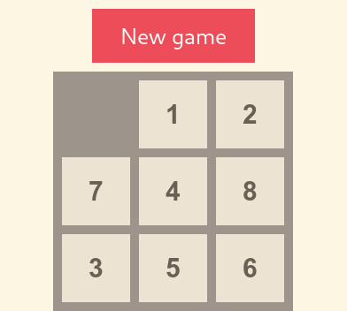

In deze oefenzitting zullen we een Sliding Puzzle maken in HTML, CSS en JavaScript.

> :warning: Deze oefenzitting wordt afgewerkt in twee sessies. Zorg ervoor dat je klaar bent met deel 1 en deel 2 *voor* de start van de tweede oefenzitting.

# Inhoudsopgave

- [Inhoudsopgave](#inhoudsopgave)
- [Voorbereiding](#voorbereiding)
- [Video](#video)
- [Structuur repository](#structuur-repository)
- [Toolchain](#toolchain)
  - [Besturingssysteem](#besturingssysteem)
  - [Editor](#editor)
  - [Web browser](#web-browser)
    - [Developer tools](#developer-tools)
- [Opdrachten](#opdrachten)
  - [Deel 1: Lay-out maken](#deel-1-lay-out-maken)
    - [Basisstructuur HTML](#basisstructuur-html)
    - [Tabel opstellen](#tabel-opstellen)
    - [Stijl toevoegen](#stijl-toevoegen)
      - [Basisstructuur CSS](#basisstructuur-css)
      - [Stijl toekennen](#stijl-toekennen)
  - [Deel 2: Interne representatie](#deel-2-interne-representatie)
    - [Doel](#doel)
    - [Opdracht](#opdracht)
  - [Deel 3: Spelfunctionaliteit](#deel-3-spelfunctionaliteit)
    - [Modeloplossing](#modeloplossing)
    - [Opdracht](#opdracht-1)
    - [Functies](#functies)
  - [Extra uitdagingen](#extra-uitdagingen)

# Voorbereiding

Start met deze oefenzitting door de repository te clonen naar je eigen machine.

# Video

Video-playlist ter voorbereiding van deze oefenzitting:

[](https://kuleuven.sharepoint.com/:f:/s/T0001816-Informaticawerktuigen/ErkTnIxkuL1JnVxAp7B_g-gBY8RfSfCbufpHMA_GBe-9oQ)

# Structuur repository

- `./tutorial`: in deze folder kan je de verschillende codevoorbeelden uit de les bekijken
- `./oplossing`: in deze folder plaats je je eigen oplossing voor deze oefenzitting

# Toolchain

## Besturingssysteem

Voor deze oefenzittingen maakt het niet uit op welk besturingssysteem je werkt; je kan ze even gemakkelijk maken in Linux, MacOS of Windows.

> :exclamation: We maken gebruik van de grafische user interface van de web browser, dus je kan deze oefenzittingen niet via een SSH-verbinding naar de departementale PCs maken.

## Editor

Je kan HTML, CSS en JavaScript schrijven met elke mogelijke text editor, zelfs met kladblok.
Het is uiteraard een goed idee gebruik te maken van een editor met minstens syntax highlighting, zoals [**Visual Studio Code**](https://code.visualstudio.com/).

## Web browser

HTML-pagina's worden geopend met een web browser.
Elk van deze browsers heeft een eigen toolchain die kan helpen bij het lezen van HTML, CSS en JavaScript.

De voorbeelden in deze oefenzitting maken gebruik van Firefox, maar je mag ook een andere web browser gebruiken.

Indien je gebruik maakt van een andere web browser is het je eigen taak om de equivalente functionaliteiten (debugger, console, ...) in die browser te vinden.

### Developer tools

Voor je begint aan de oefenzitting is het een goed idee vertrouwd te geraken met de Developer Tools van de web browser.

* Open het laatste voorbeeld uit de tutorial (`./tutorial/ex7/index.html`) in een web browser.
  * Je kan in je file explorer navigeren naar het `index.html` bestand.
    De meeste besturingssystemen zullen dit bestand openen in de default web browser als je hier op dubbelklikt.
    Indien niet, kan je door middel van een rechtermuisklik selecteren met welke applicatie je het bestand wilt openen.


  * Op Linux kan dit ook gemakkelijk via de terminal door naar de map van deze geclonede oefenzitting te navigeren en dan Firefox te openen:

    ```shell
    cd sliding-puzzle-<r-nummer>
    firefox ./tutorial/ex7/index.html
    ```

  * Je kan ook het pad naar dit `index.html`-bestand kopiëren en in de adresbalk van je browser plakken.
    Afhankelijk van je besturingssysteem ziet dit er ongeveer uit zoals hier:

    ```shell
    # Linux
    /home/<username>/.../sliding-puzzle-<r-nummer>/tutorial/ex7/index.html

    # MacOS
    /Users/<username>/.../sliding-puzzle-<r-nummer>/tutorial/ex7/index.html

    # Windows
    C:\Users\<username>\...\sliding-puzzle-<r-nummer>\tutorial\ex7\index.html
    ```

* In de web browser druk je op de toetsencombinatie <kbd>CTRL</kbd>+<kbd>SHIFT</kbd>+<kbd>I</kbd> (of <kbd>COMMAND</kbd>+<kbd>OPTION</kbd>+<kbd>I</kbd> voor Mac) om de Developer Tools te openen.
  * Je kan natuurlijk ook met je rechtermuisknop op de pagina klikken en de optie `inspecteren` selecteren om in de *inspector* uit te komen.
  * Alternatief ondersteunen de meeste browsers het gebruik van de <kbd>F12</kbd> toets om de Developer Tools te openen.

> :warning: Let er op dat alle aanpassingen die je maakt in de Developer Tools tijdelijk zijn en ongedaan worden gemaakt na het verversen van de pagina.
Gebruik voor permanente wijzigingen een editor naar keuze.

Voer onderstaande acties uit met behulp van de Developer tools.
Ververs indien nodig de pagina om eventuele wijzigingen ongedaan te maken.

* Verwijder met behulp van de *inspector* de Reset-knop op de pagina.
  1. Zoek het element van de knop in de *inspector*.
  2. Klik met je rechtermuisknop op het element.
  3. Selecteer "verwijder element".
  4. Alternatief kan je de <kbd>Delete</kbd>-knop gebruiken.
* Open de console.
  Voer deze functie uit: `update_board(my_board, 0, 1, 2)`. Observeer wat er gebeurt.
* Verander de waarden in `update_board` en probeer op die manier een X te plaatsen in het middelste vakje.
  * Hint: met de <kbd>&#8593;</kbd>-toets kan je het laatst ingevoerde commando terug ophalen.
* Zoek en open het bestand `code.js` in de *debugger*.
  Plaats een breakpoint in de binnenste for-loop van de functie `generate_board_html` door op de nummer van die regel te klikken.
  Klik vervolgens op een vakje van het spelbord.
  Inspecteer de waarden van de variabele `table_inner_html` in de rechtse kolom van de debugger (onder *scopes*).
  * In andere browsers kan de debugger anders werken.
    Zo zal je bijvoorbeeld in Chrome via het tabblad *bronnen* moeten gaan in de plaats van *debugger*.
* Druk op de Run-pijl bovenaan om de code verder uit te voeren tot het volgende breakpoint.
  Observeer hoe de waarden van `table_inner_html` en `row_html` evolueren na elke iteratie van de lus.
* Open de *Style editor* en zorg ervoor dat alle rode vakjes paars worden.

# Opdrachten

## Deel 1: Lay-out maken

Open in de folder `./oplossing` in je repository het bestand met de naam `index.html`.
Dit bestand bevat een algemeen skelet dat je kan gebruiken voor elke mogelijke html-pagina.

### Basisstructuur HTML

HTML is een variant van XML waarmee je de lay-out van een webpagina kan beschrijven op een wijze die voor beide mens en machine interpreteerbaar is.

Een HTML-document maakt als volgt gebruik van tags met attributen:

``` html
<tag attribute="value">content</tag>
```

### Tabel opstellen

``` html
<body>
Hello, world!
</body>
```

* Vervang de tekst "*Hello, world!*" in `index.html` door een tabel van 3x3.
  Maak hiervoor gebruik van de tags `table`, `tr` en `td`.
  Bekijk [deze pagina](https://www.w3schools.com/html/html_tables.asp) indien je niet weet hoe je een HTML-tabel moet maken.
* Vul in elke cel van de tabel een uniek nummer in van 1 tot en met 8.
* Laat 1 cel leeg.
  Deze cel stelt het lege vakje op de schuifpuzzel voor.

### Stijl toevoegen

Om deze tabel wat groter, mooier en duidelijker te maken zullen we door middel van *CSS* stijlen toevoegen.

#### Basisstructuur CSS

Met behulp van CSS kan je stijlen toekennen aan HTML-tags (en hun inhoud).

De basissyntax werkt als volgt:

``` css
tag {
    property: value;
}

.class {
    property: value;
}

#id {
    property: value;
}

```

Onderstaande voorbeeldcode geeft de achtergrondkleur `#fffff0` aan elke `table`-tag in het HTML-document.

``` css
table {
    background-color: #fffff0;
}
```

Om stijlen toe te kennen aan individuele tags, kunnen we ze een klasse geven.
Het is mogelijk om dezelfde klasse aan meerdere tags toe te kennen.

Onderstaande code kent de klasse `my_class` toe aan de `div` en de `p` tag.

``` html
<div class="my_class"></div>
<p class="my_class"></p>
```

In de CSS stylesheet kunnen we nu de stijl van de klasse `my_class` vastleggen.

``` css
.my_class {
    border: 1px solid #000000;
}
```

Als resultaat krijgen beide de `div` en de paragraaf (`p`) een zwarte doorlopende rand met een breedte van 1 pixel.

#### Stijl toekennen

Open het bestand `stylesheet.css`.

Probeer met behulp van CSS de lay-out in de afbeelding bovenaan deze pagina na te maken.
De kleuren mag je zelf kiezen.

Zorg ervoor dat:

  * De vakjes groot genoeg zijn.
  * Elk vakje zichtbaar gescheiden is door een rand.
  * Het lege vakje dezelfde achtergrondkleur heeft als de tabel zelf.
  * De tekst in de vakjes gecentreerd is.

Als voorbeeld kan je kijken naar het bestand `./tutorial/ex7/stylesheet.css`.

Alle mogelijke stijlen die je via CSS kan toekennen kan je vinden op [https://www.w3schools.com/cssref/](https://www.w3schools.com/cssref/).

## Deel 2: Interne representatie

Een sliding puzzle kan, net zoals vele andere bordspellen, in JavaScript voorgesteld worden als een tweedimensionale lijst.

Onderstaande code definieert een tweedimensionale lijst die de Sliding Puzzle uit de afbeelding bovenaan deze pagina voorstelt.
We hebben de waarde 0 gekozen voor het lege vakje.

```JavaScript
let my_puzzle = [[0, 1, 2],
                 [7, 4, 8],
                 [3, 5, 6]];
```

### Doel

Het doel van deze sectie is om de JavaScript-functie `generate_puzzle_html` te schrijven.
Deze functie zet de bovenstaande lijstrepresentatie om in een HTML-string.

Wanneer de sectie correct is uitgevoerd en je `index.html` opent met Firefox, zal je puzzel visueel verschijnen.

Onderstaande code toont het *einddoel* van deze sectie met behulp van de JavaScript-console.
De functie `generate_puzzle_html` wordt opgeroepen met als input de lijstrepresentatie van onze puzzel.
Het resultaat van de functie is een JavaScript-string met daarin een HTML-voorstelling van diezelfde puzzel.
De JavaScript-functie `generate_puzzle_html` converteert dus de lijstrepresentatie in `my_puzzle` naar een HTML-representatie:

```JavaScript
generate_puzzle_html(my_puzzle)
>> '<table><tr><td class="emptyTile"></td><td>1</td><td>2</td></tr><tr><td>7</td><td>4</td><td>8</td></tr><tr><td>3</td><td>5</td><td>6</td></tr></table>'
```

### Opdracht

* Voeg aan je HTML-bestand een `div` toe met als id `puzzle_container`.
Hierin zal de gegenereerde HTML-code toegevoegd worden.

```HTML
<div id="puzzle_container"></div>
```

* Vul nu de functie `generate_puzzle_html` in `code.js` aan zodat het resultaat van de functie een HTML-weergave is van de meegegeven puzzel.
  **De uitvoering van generate_puzzle_html moet in de JavaScript-console een HTML-string als resultaat geven**.

Baseer je op de HTML die je geschreven hebt in het eerste deel van deze oefenzitting.

Indien de code correct werkt, zal de pagina na een refresh de gegenereerde sliding puzzle toevoegen aan `puzzle_container`.
De code die hiervoor zorgt is reeds meegeleverd in de JavaScript-functie `draw_puzzle`. Na de pagina te verversen zal je puzzel dus visueel verschijnen.

> :bulb: Bestudeer voor tips de oplossing in `./tutorial/ex7/code.js`.
  De functie `generate_board_html` van deze oefening werkt zeer gelijkaardig.

> :bulb: Indien de code niet werkt zoals verwacht, open dan de Developer Tools van Firefox.
  Open vervolgens de *debugger* en plaats breakpoints op kritische punten in je code.
  Inspecteer de waarden van je variabelen en probeer te achterhalen wat fout loopt.

## Deel 3: Spelfunctionaliteit

Op dit punt in de oefenzitting heeft je spel een lay-out die automatisch gegenereerd kan worden vanuit een interne lijstrepresentatie.

### Modeloplossing

**Indien je aan de start van de tweede oefenzitting nog niet op dit punt bent gekomen**, kan je voor de volgende delen verder werken vanaf een modeloplossing.

Indien je eigen aanpassingen hebt gemaakt aan de bestanden in `./oplossing`, zal je deze wijzigingen eerst moeten committen.

```bash
cd /pad/naar/oefenzitting-javascript
git add code.js
git add stylesheet.css
git add index.html
git commit -m "Eigen oplossing"
```

Deze code maakt een back-up van je eigen oplossingsbestanden.
Je kan deze in de toekomst dus telkens herstellen.

Voer vervolgens het volgende commando uit om de modeloplossing te laden:

``` bash
git checkout deel2
```

Door dit commando uit te voeren wordt de inhoud van de modeloplossing in de folder `./oplossing` geplaatst.

### Opdracht

In deze sectie schrijven we JavaScript-functies die op basis van de interne lijstrepresentatie van een puzzel ons toelaten het spel te spelen.

Voeg onderstaande functies toe aan `code.js`.
Gebruik telkens de *console* in de Developer Tools om deze functies te testen.
De voorbeelden tonen telkens de console-output die we verwachten indien je functie correct is geschreven.

### Functies

* `function check_game_complete(puzzle)`

    Deze functie krijgt als argument de puzzel (voorgesteld als lijst).
    De functie moet `true` returnen indien de sliding puzzle correct is opgelost, en `false` op alle andere momenten.
    De puzzel is correct opgelost indien alle nummers in de juiste volgorde staan **met het lege vakje onderaan rechts**.

    * Implementeer de functie en test met behulp van de console:

    ```JavaScript
    >> check_game_complete(my_puzzle)
    false
    >> check_game_complete([[1, 2, 3], [4, 5, 6], [7, 8, 0]])
    true
    ```

    > :bulb: Vergelijk twee lijsten door met een lus elk indivueel element apart te vergelijken

* `function swap_empty_square(puzzle, row, col)`

    Deze functie krijgt als invoer de huidige puzzel voorgesteld als lijst en een rij en kolom op het bord.
    De functie wisselt het vakje op die positie op het spelbord met het lege vakje.

    * Implementeer de functie en test met behulp van de console:

    ```JavaScript
    >> swap_empty_square(my_puzzle, 1, 0)
    undefined
    >> draw_puzzle(my_puzzle)
    undefined
    ```

    Na uitvoering van deze functies zou het lege vakje moeten wisselen met het vakje met waarde 7.

    * Zorg er nu ook voor dat de wissel enkel wordt uitgevoerd indien het lege vakje naast de meegegeven positie ligt.
    Verifieer nadien opnieuw met de console.

* `function square_click_handler(cell)`

    Ten slotte schrijven we de functie die opgeroepen zal worden telkens wanneer we klikken op een plaats op het spelbord.

    Met onderstaande code kan je opvragen op welke positie er geklikt werd:

    ```JavaScript
    let col = cell.cellIndex;
    let row = cell.parentNode.rowIndex;
    ```

    * Implementeer deze functie.
      * Zorg ervoor dat de code gebruik maakt van de functie `swap_empty_square` om het vakje waarop geklikt werd te wisselen met het lege vakje.
      * Zorg er vervolgens voor dat het spelbord opnieuw getekend wordt met behulp van `draw_puzzle`.
      * Controleer met `check_game_complete` of het spel correct is opgelost.
      * Indien het spel correct is opgelost, voer dan de code  `alert("Proficiat!");` uit.

    Om dit te testen willen we ervoor zorgen dat wanneer er op een cel geklikt wordt, `square_click_handler` correct wordt opgeroepen.

    Maak hiervoor gebruik van het `onclick` attribuut.

    Voeg aan de `td`-tags `onclick` toe als volgt:

    ```html
    <td onclick="square_click_handler(this)"></td>
    ```

    * Zorg ervoor dat het onclick-attribuut correct mee toegevoegd wordt bij het genereren van de HTML-representatie van het bord.

    > :heavy_check_mark: Als dit correct uitgevoerd wordt, heb je nu een werkende Sliding Puzzle. Proficiat!

## Extra uitdagingen

* Zorg ervoor dat het spelbord willekeurig gegenereerd wordt. Let erop dat niet alle schuifpuzzels oplosbaar zijn.
* Zorg ervoor dat de de grootte van de schuifpuzzel gekozen kan worden door de speler (bijvoorbeeld 4x4 of 5x5).
* Voeg een timer toe die bijhoudt hoe lang je erover doet om een puzzel op te lossen.
